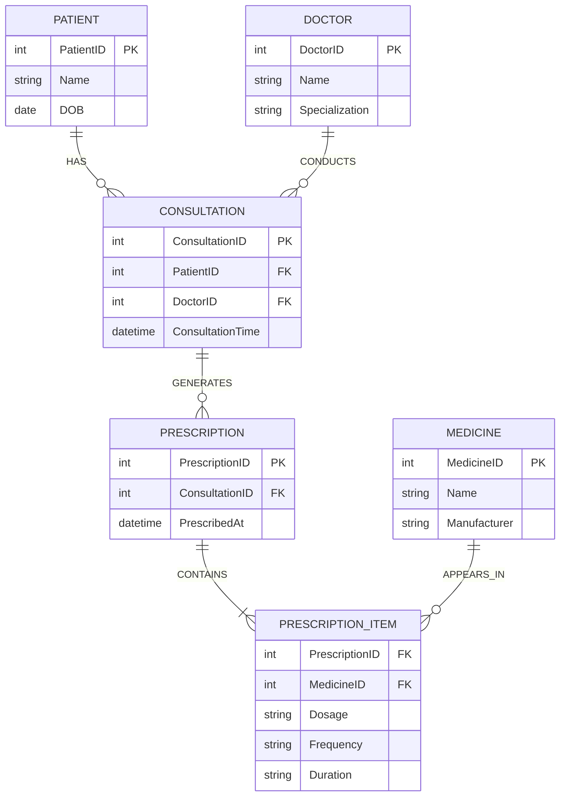
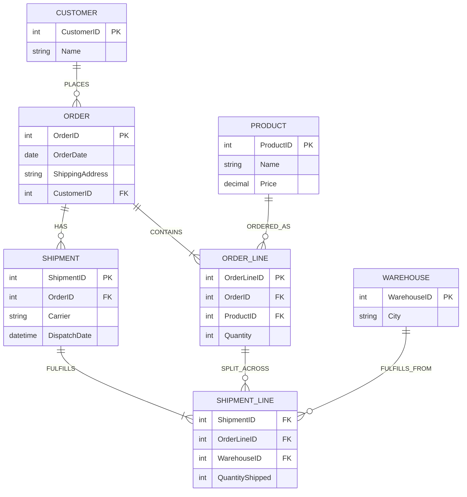
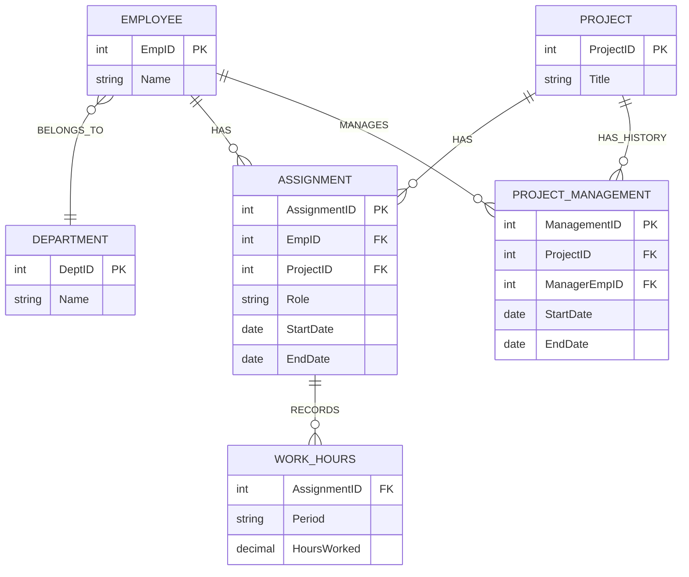
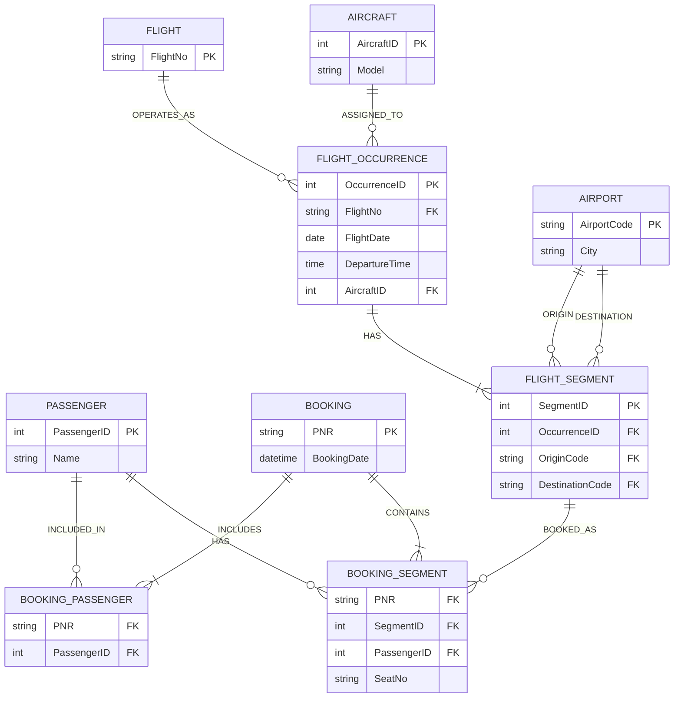

# DBMS-assignment--1
# Question 1 — University Course Registration

## Issue 1 — Course is being used for both the course and its offering

**Flaw:** `Semester` and `Year` are stored directly in `Course`.

**Information lost:** A course can have multiple offerings, and multiple sections can exist in the same semester. A single `Course` occurrence cannot represent those separate offerings/sections correctly.

**Minimal correction:** Keep `Course` as the catalog-level entity and we will introduce `Section` (or `CourseOffering`) for a particular offering.

## Issue 2 — ENROLLS connects Student directly to Course

**Flaw:** A student registers for a `Course`, but the business rule says registration is for a particular section.

**Information lost:** We cannot determine which section the student selected when the same course has multiple sections.

**Minimal correction:** Change the relationship to:

`Student -- ENROLLS --> Section`

## Issue 3 — TEACHES connects Instructor directly to Course

**Flaw:** The instructor is assigned to the course rather than to a particular section.

**Information lost:** Different sections of the same course may have different instructors, but the model cannot record that assignment.

**Minimal correction:** Change the relationship to:

`Instructor -- TEACHES --> Section`

## Issue 4 — HELD_IN connects Course directly to Classroom

**Flaw:** Classroom allocation is attached to the course instead of the section.

**Information lost:** Two sections of the same course may be held in different classrooms, so the model cannot represent section-specific classroom allocation.

**Minimal correction:** Change the relationship to:

`Section -- HELD_IN --> Classroom`

## Corrected ER Fragment

erDiagram
    STUDENT {
        int StudentID PK
        string Name
        string Email
    }

    COURSE {
        int CourseID PK
        string Title
        int Credits
    }

    SECTION {
        int SectionID PK
        int CourseID FK
        string Semester
        Year
    }

    INSTRUCTOR {
        int InstructorID PK
        string Name
        string Department
    }

    CLASSROOM {
        string RoomNo PK
        string Building
    }

    STUDENT }o--o{ SECTION : ENROLLS
    COURSE ||--o{ SECTION : OFFERED_AS
    INSTRUCTOR }o--o{ SECTION : TEACHES
    SECTION }o--|| CLASSROOM : HELD_IN

---

# Question 2 — Hospital Prescription System

## Business Rules

- A patient may consult the same doctor many times.
- Different consultations may result in different prescriptions.
- The dosage of the same medicine may differ by patient and visit.
- The same medicine may be prescribed again with a different frequency or duration.
- A prescription must identify who prescribed what, to whom, and when.

## Issue 1 — CONSULTS cannot represent repeated visits

**Flaw:** `CONSULTS` directly connects Patient and Doctor.

**Information lost:** The same patient can consult the same doctor multiple times, but there is no entity representing each individual visit. Therefore, the date/time and history of each consultation cannot be stored separately.

**Minimal correction:** Introduce a `Consultation` entity.

`Patient -- Consultation -- Doctor`

## Issue 2 — PRESCRIBES does not identify the patient

**Flaw:** `PRESCRIBES` connects Doctor directly to Medicine.

**Information lost:** The model cannot determine which patient received the medicine.

**Minimal correction:** Make prescriptions belong to a particular consultation/patient and doctor.

`Consultation -- Prescription -- Medicine`

## Issue 3 — TAKES does not identify the consultation/prescription

**Flaw:** `TAKES` directly connects Patient and Medicine.

**Information lost:** If the same medicine is prescribed multiple times, the model cannot distinguish one prescription from another or associate it with the correct visit.

**Minimal correction:** Connect medicine to a prescription/consultation rather than directly to the patient.

## Issue 4 — Dosage is incorrectly stored as a Medicine attribute

**Flaw:** `Dosage` is stored in `Medicine`.

**Information lost:** Dosage, frequency, and duration are not properties of the medicine itself. They can vary for different patients and different visits.

**Minimal correction:** Move prescription-specific instructions to a prescription line/medication entity.

## Corrected ER Fragment

This preserves repeated consultations, prescription history, patient-specific dosage, and time-dependent instructions.

---

# Question 3 — E-Commerce Order Fulfilment

## Business Rules

- A customer may use a different delivery address for every order.
- Quantity is specific to an order line, not to the product itself.
- One order may be split into several shipments.
- A single order line may be partially shipped from different warehouses.
- Each shipment has its own dispatch date and carrier information.

## Issue 1 — ShippingAddress is stored in Customer

**Flaw:** `ShippingAddress` is an attribute of `Customer`.

**Information lost:** A customer may use a different address for every order. Storing only one address on Customer loses the historical address used for previous orders.

**Minimal correction:** Move `ShippingAddress` to `Order`.

## Issue 2 — Quantity is stored in Product

**Flaw:** `Quantity` is an attribute of `Product`.

**Information lost:** Quantity belongs to a particular order line. The same product can be ordered in different quantities by different customers or in different orders.

**Minimal correction:** Move `Quantity` to the Order–Product associative entity, represented as `OrderLine`.

## Issue 3 — Shipment is connected only to Order

**Flaw:** `SHIPPED_BY` connects Order to Shipment, but there is no relationship between Shipment and individual OrderLines.

**Information lost:** The model cannot represent that one order line is partially fulfilled by different shipments or warehouses.

**Minimal correction:** Introduce `ShipmentLine` connecting `Shipment` and `OrderLine`, with `QuantityShipped`.

## Issue 4 — Shipment date is stored at Order level

**Flaw:** `ShipmentDate` is stored in `Order`.

**Information lost:** An order can have several shipments, and each shipment has its own dispatch date. One date at order level cannot represent the dates of all shipments.

**Minimal correction:** Move `ShipmentDate` to `Shipment` as `DispatchDate`.

## Corrected ER Fragment

---

# Question 4 — Project Staffing and Roles

## Business Rules

- An employee may join, leave, and later rejoin the same project.
- The employee's role may be different on different projects.
- Hours are recorded per employee-project assignment and time period.
- Project managers may change during the lifetime of a project.
- Management history must be retained for audit purposes.

## Issue 1 — Role is stored in Employee

**Flaw:** `Role` is an attribute of `Employee`.

**Information lost:** An employee can have different roles on different projects. A single role on Employee cannot represent project-specific roles.

**Minimal correction:** Move `Role` to the project assignment entity.

## Issue 2 — HoursWorked is stored in Project

**Flaw:** `HoursWorked` is an attribute of `Project`.

**Information lost:** Hours belong to an employee-project assignment and a time period. A project-level value cannot tell which employee worked how many hours or during which period.

**Minimal correction:** Move hours to an assignment/time-record structure.

## Issue 3 — WORKS_ON cannot represent repeated assignments

**Flaw:** A direct Employee–Project relationship does not preserve multiple periods of assignment.

**Information lost:** If an employee leaves a project and later rejoins it, the model cannot store the two separate assignment periods.

**Minimal correction:** Replace/upgrade `WORKS_ON` into an `Assignment` entity containing `StartDate` and `EndDate`.

## Issue 4 — MANAGED_BY cannot preserve management history

**Flaw:** A direct Employee–Project `MANAGED_BY` relationship represents the current manager but has no time period.

**Information lost:** When managers change, previous managers and their management periods cannot be retained for audit.

**Minimal correction:** Introduce `ProjectManagement` with `StartDate` and `EndDate`.

## Corrected ER Fragment

---

# Question 5 — Airline Booking and Seat Assignment

## Business Rules

- A flight number operates on many dates.
- One PNR may contain several passengers and several flight segments.
- Aircraft assignment may change for one particular flight occurrence.
- A seat is assigned to a passenger for a specific flight occurrence.
- The same passenger may have different seats on different segments.

## Issue 1 — Flight and Flight Occurrence are conflated

**Flaw:** `Flight` contains `FlightNo`, `Date`, and `DepartureTime` in one entity.

**Information lost:** A flight number is a recurring service that operates on many dates. The model should distinguish the flight definition/number from a particular occurrence of that flight.

**Minimal correction:** Introduce `FlightOccurrence` for a particular date/time.

`Flight -- HAS --> FlightOccurrence`

## Issue 2 — BOOKS directly connects Passenger and Flight

**Flaw:** There is no `PNR/Booking` entity.

**Information lost:** One PNR may contain several passengers and several flight segments. A direct Passenger–Flight relationship cannot represent the grouping represented by one booking.

**Minimal correction:** Introduce `Booking/PNR` and connect passengers and booked segments through it.

## Issue 3 — Aircraft assignment is attached to the wrong level

**Flaw:** `USES` connects Aircraft directly to the recurring Flight.

**Information lost:** Aircraft may change for a particular flight occurrence. An aircraft assigned to one date should not imply that the same aircraft is permanently assigned to every occurrence of the flight number.

**Minimal correction:** Connect `Aircraft` to `FlightOccurrence`.

## Issue 4 — SEATED_ON connects Passenger to Aircraft

**Flaw:** The seat assignment is modeled between Passenger and Aircraft.

**Information lost:** A seat belongs to a passenger for a specific flight occurrence/segment. The same passenger can have different seats on different segments.

**Minimal correction:** Store `SeatNo` on the relationship/entity that connects a passenger's booking segment to the specific flight occurrence.

## Corrected ER Fragment

The important point is that `SeatNo` is attached to a **specific passenger + booking segment**, rather than to the passenger or aircraft globally.

---
